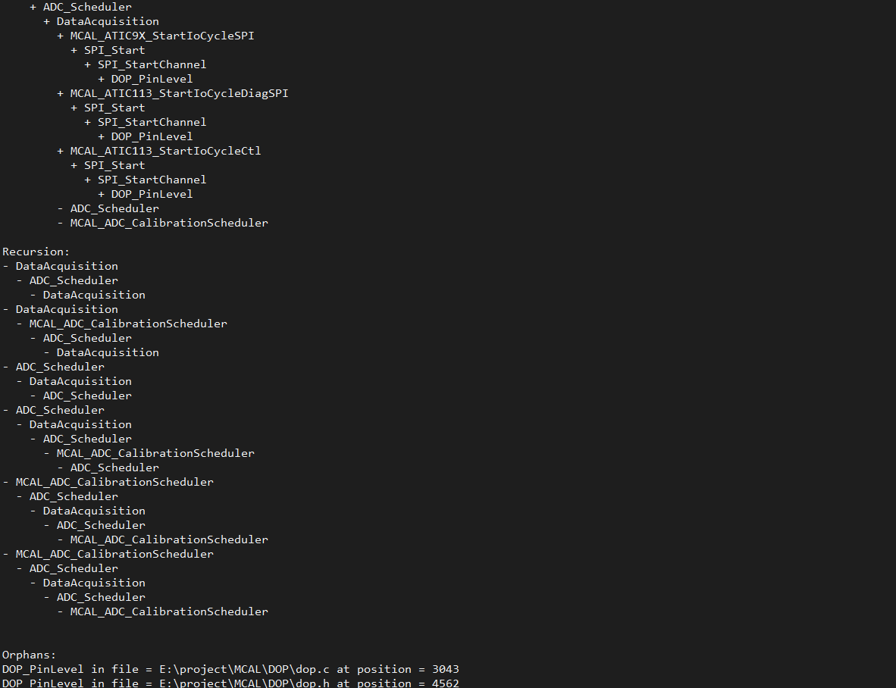

# Callstack

This script searches a directory for .c and .h files. If the input argument matches the name of a function, then the script creates a calltree of all calling functions that call the named function.

# Example Output

Show Tree:
+ SPI_Isr
    + DOP_PinLevel
    + SPI_StartChannel
        + DOP_PinLevel
+ SetSignal_b_PT_Relay
    + MCAL_DOP_PinLevelPT_Relay
        + DOP_PinLevel
        + MCAL_DOP_PinLevelRcp1
            + DOP_PinLevel
        + MCAL_DOP_PinLevelRcp2
            + DOP_PinLevel
+ STU_Main
    + HOOK_PrjHookFunctionInit
        + MCAL_DOP_PinLevelAtic9xDis
            + DOP_PinLevel
        + MCAL_ATIC103_ReqSetStatus
            + SPI_Start
                + SPI_StartChannel
                    + DOP_PinLevel
        + MCAL_ATIC113_StartIoCycleCtl
            + SPI_Start
                + SPI_StartChannel
                    + DOP_PinLevel
        + MCAL_ATIC103_EOT_Update
            + MCAL_ATIC103_SetShutdownTimerEna
                + SPI_Start
                    + SPI_StartChannel
                        + DOP_PinLevel
        + MCAL_ATIC9X_StartIoCycle
            + MCAL_ATIC9X_StartIoCycleSPI
                + SPI_Start
                    + SPI_StartChannel
                        + DOP_PinLevel
        + MCAL_ATIC113_StartIoCycleDiag
            + MCAL_ATIC113_StartIoCycleDiagSPI
                + SPI_Start
                    + SPI_StartChannel
                        + DOP_PinLevel
+ MCAL_ATIC103_ReqEngineOffTime
    + SPI_Start
        + SPI_StartChannel
            + DOP_PinLevel
+ Task100msec
    + MCAL_ADC_CalibrationScheduler
        + ADC_Scheduler
            + DataAcquisition
                + MCAL_ATIC9X_StartIoCycleSPI
                    + SPI_Start
                        + SPI_StartChannel
                            + DOP_PinLevel
                + MCAL_ATIC113_StartIoCycleDiagSPI
                    + SPI_Start
                        + SPI_StartChannel
                            + DOP_PinLevel
                + MCAL_ATIC113_StartIoCycleCtl
                    + SPI_Start
                        + SPI_StartChannel
                            + DOP_PinLevel
                - ADC_Scheduler
                - MCAL_ADC_CalibrationScheduler

Recursion:
- DataAcquisition
    - ADC_Scheduler
        - DataAcquisition
- DataAcquisition
    - MCAL_ADC_CalibrationScheduler
        - ADC_Scheduler
            - DataAcquisition
- ADC_Scheduler
    - DataAcquisition
        - ADC_Scheduler
- ADC_Scheduler
    - DataAcquisition
        - ADC_Scheduler
            - MCAL_ADC_CalibrationScheduler
                - ADC_Scheduler
- MCAL_ADC_CalibrationScheduler
    - ADC_Scheduler
        - DataAcquisition
            - ADC_Scheduler
                - MCAL_ADC_CalibrationScheduler
- MCAL_ADC_CalibrationScheduler
    - ADC_Scheduler
        - DataAcquisition
            - ADC_Scheduler
                - MCAL_ADC_CalibrationScheduler

Orphans:
DOP_PinLevel in file = E:\project\MCAL\DOP\dop.c at position = 3043
DOP_PinLevel in file = E:\project\MCAL\DOP\dop.h at position = 4562
MCAL_ATIC123_Enable in file = E:\project\MCAL\HBR\hbr.c at position = 5758
MCAL_ATIC123_Disable in file = E:\project\MCAL\PWM\pwm.c at position = 16973
MCAL_ATIC123_Disable in file = E:\project\MCAL\PWM\pwm.c at position = 17073
MCAL_ATIC123_Disable in file = E:\project\MCAL\PWM\pwm.c at position = 17172
